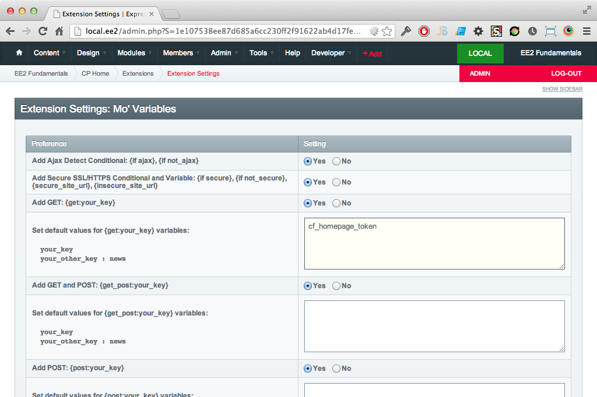

Creating a Homepage
===================

In this chapter we're going to:

* Create a new channel for the homepage (bear with me)
* Create a new custom field group and custom fields
* Create a homepage template
* Add SEO meta to the homepage
* Running content experiements on multiple homepages
* Implement workflow approval processes

Creating a homepage channel
---------------------------

For those of you who have experience with ExpressionEngine you might be thinking "Homepage channel" WTF is this guy on. Creating a homepage channel, and therefore multiple homepage channel entries has the following benefits:

* Custom fields just for the homepage. Allow site admins to change parts of the homepage that would normally difficult to change. Yes there are snippets and global variables but that means your site admins need to learn another user interface
* Schedule homepage updates with publish dates for things like holidays and other special events.
* Run content experiments using different homepages

Create a channel with the following attributes:

* Full Channel Name: `Homepage`
* Short Name: `homepage`

Then edit the channel preferences and set the following attributes:

* Channel URL: `/`
* Enable Entry Versioning: `Yes` - Trust me, one day you'll need to roll back a change. This will save you.
* Allow comments in this channel?: `no`
* Display Rich Formatting Buttons: `no`

Creating homepage custom fields
-------------------------------

Creating the Homepage channel was straight forward now let's create the homeage custom field group and custom fields and assign them to the channel.

Create a new custom field group with the following attributes:

* Group Name: `Homepage`

Now add the following custom fields:

1. Content:
	* Label: `Content`
	* Short Name: `cf_homepage_content`
	* Type: `Textarea (Rich Text)`

Then assign the custom field group to the channel.

### Custom field naming conventions 

Why `cf_homepage_content`? Naming conventions are an important part of creating any system especially when there are multiple developers. 

I use the following naming convention for all my custom fields:

	cf_ + channel_short_name + _ + field_name

* cf_ is short for 'Custom Field'. Later on we'll look at Global Variables ('gv_') and Snippets ('sn_')
* channel_short_name: In this case `homepage`
* field_name: In this case `content`

### One custom field group per channel

Follow the "one custom field group per channel rule" and you'll save yourself a lot of pain in the future. Don't be tempted to try and share a custom field group. Inevitably channel content will diverge and you'll have to explain to a content administrator why some fields work in some channels and not in others.

But what about [Publish Page Layouts](http://ellislab.com/expressionengine/user-guide/cp/content/publish_page_layouts.html)? We'll you could try and hide un-needed custom fields but they will stil be available in the templates which will cause issues for developers.

So say it out loud "one custom field group per channel" - no exceptions.

Publish a new homepage
----------------------

Let's test out the new channel custom fields. Go [publish a new Homepage channel entry](http://ellislab.com/expressionengine/user-guide/cp/content/publish.html) and set the title to 'Homepage 1'.

Creating homepage templates
---------------------------

I generally follow "one template group per channel" naming the template group after the channel. Example: If there is a `blog` channel there will be a corresponding `blog` template group. 

However in this case an exception is made. We'll create a `site` template group instead. Why `site`? Saying it out loud makes sense: `site/index`. We'll also eventually create a `site/four04`, `site/_header` and `site/_footer` template. Creating the template group automatically creates a new `index` template.

Create a new template group with the following attributes:

* Template Group Name: `site`
* Make the index template in this group your site's home page?: `yes`

Here's the template code:

```html
{exp:channel:entries
    channel="homepage"
    limit="1"
    dynamic="no"
}

{if no_results} {redirect="404"}{/if}

<h1>{title}</h1>
{cf_homepage_content}
{/exp:channel:entries}
```

Pretty straight forward but let's break it down.

* `{exp:channel:entries` - Open the channel entries loop. [[user guide](http://ellislab.com/expressionengine/user-guide/modules/channel/channel_entries.html)]
* `channel="homepage"` - We only want to load homepage channel. [[user guide](http://ellislab.com/expressionengine/user-guide/modules/channel/channel_entries.html#channel)]
* `limit="1"` - We're going to publish multiple homepage entries but we only need to show one. [[user guide](http://ellislab.com/expressionengine/user-guide/modules/channel/channel_entries.html#limit)]
* `dynamic="no"` - I always include this just incase other parameters are added to the URL. [[user guide](http://ellislab.com/expressionengine/user-guide/modules/channel/channel_entries.html#dynamic)]
* `}` - Close the openning tag
* `{if no_results} {redirect="404"}{/if}` - Another defensive move. We're assuming the URL is fine and theres an open entry if there's not we'll redirect to a 404 page
* `<h1>{title}</h1>` - Standard entry title tag [[user guide](http://ellislab.com/expressionengine/user-guide/modules/channel/channel_entries.html#title)]
* `{cf_homepage_content}` - Content custom field [[user guide](http://ellislab.com/expressionengine/user-guide/modules/channel/custom_fields.html)]
* `{/exp:channel:entries}` - Close the channel entries loop.

Preview the homepage
--------------------

Visit <http://local.ee-book.com>. You should see the entry title and content. If not something has gone wrong (probably my instructions).

Viewing alternative homepages
-----------------------------

By default ExpressionEngine will show the latest open Homepage entry (the one you just published) but we need a way to force the `{exp:channel:entries}` tag to render an alternative homepage. We also have to make sure that a user could not stumble upon the alternate homepage accidentally exposing confidential data.

### Create new 'Homepage' channel entry

We'll need to test altenrate homepages we'll need a new 'Homepage' channel entry (duh).

1. Create a new 'Homepage' channel entry
2. Set the title to 'Homepage 2' so you can identiy the alternative.
3. Save the entry
4. Refresh <http://local.ee-book.com>

The page should now display 'Homepage 2'.

### Create a new status

The first security measure we need to implement is to create a new status and assign it to the entry. We'll use a status other than 'open' so it's not rendered in the `{exp:channel:entries}` tag by default.

The default ExpressionEngine install ships with a default status group called '[Statues](http://ellislab.com/expressionengine/user-guide/cp/admin/channels/statuses.html)'. Unfortunately the 'Statues' status group is not automatically.

1. Create a new 'pending' status in the 'Statues' status group. [[user guide](http://ellislab.com/expressionengine/user-guide/cp/admin/channels/statuses_edit.html)]
2. Assign the 'Statuses' status group to the Homepage channel [[user guide](http://ellislab.com/expressionengine/user-guide/cp/admin/channels/channel_groups.html#status-group)]

_A note about statues:_

IMO channel statuses should be used for **publishing workflows only**. 'open', 'closed', 'pending' and 'review' are publishing workflow statueses while 'featured' is used for display and should be implemented using custom fields and the [`search:field_name=`](http://ellislab.com/expressionengine/user-guide/modules/channel/channel_entries.html#search-field-name) parameter. This approach allows and entry to be 'featured' and 'pending' at the same time.

### Add a secure token custom field

We'll need a `cf_homepage_token` to identify the entry via a query string parameter. The same `cf_homepage_token` will be used to search for the entry in the `{exp:channel:entires}` tag.

Create a new custom field in the 'Homepage' Custom field group with the following attributes:

* Field Label: Token
* Short Name: cf_homepage_token
* Type: Text Input

### Update 'Homepage 2'

The 'Homepage' channel should now have a new custom field and status. Update the 'Homepage 2' channel entry:

1. Set the status to 'pending'
2. Add a token to the 'Token' field. The 'Token' should be a random string that's hard to guess or brute force. [Here's a couple](http://www.random.org/strings/?num=10&len=20&digits=on&upperalpha=on&loweralpha=on&unique=on&format=html&rnd=new) to get started.
3. Refresh <http://local.ee-book.com>

The page should now display 'Homepage 1' as 'Homepage 2' is now 'pending'.

### Install Mo Variables

In order to access get and post request variables we'll need to install Mo Variables.

[Rob Sanchez](https://github.com/rsanchez) created this simple but powerful addon that allows us to output get, post and many other variables in your templates. These variables can also be used in template conditionals.

1. [Download & install Mo Variables](http://devot-ee.com/add-ons/mo-variables).
2. Browse to the Mo Variables extension settings page
3. Add 'cf_homepage_token' to 'Set default values for {get:your_key} variables' which makes sure there's a default value.



### Update the `site/index` template

Now we've updated the 'Homepage' channel and installed Mo Variables the final step is to update the `site/index` template.

```html
{exp:channel:entries
    channel="homepage"
    limit="1"
    dynamic="no"

    {if get:cf_homepage_token != ""}
    status="open|pending"
    search:cf_homepage_token="{embed:get:cf_homepage_token}"
    {/if}
}

{if no_results} {redirect="404"}{/if}

<h1>{title}</h1>
{cf_homepage_content}
{/exp:channel:entries}
```
We added a conditional inside the openning `{exp:channel:entries}` tag. This approach is **fraught with danger** which requires a strong understanding of the ExpressionEngine template parese order and conditionals. Thankfully [@low](http://gotolow.com) has published [an excellent guide](http://loweblog.com/downloads/ee-parse-order.pdf) on the topic. Additionally enabling [template debugging](http://ellislab.com/expressionengine/user-guide/cp/admin/output_and_debugging_preferences.html#display-template-debugging) will help debug any issues.

### View the alternate homepage

Finally everything is in place. To view the alternative homepage visit <http://local.ee-book.com?cf_homepage_token=[insert cf_homepage_token here]>.

Mo Variables will identify the `cf_homepage_token` query parameter, transform it into the `{get:cf_homepage_token}` tag / conditional which we'll use to search for our alternate homepage.


Conclusion
----------

If you made it through congratulations! We've covered quite a bit in this chapter including. Hopefully you'll have a good understanding of channels, custom fields, statues, templates, conditionals and query parameters.